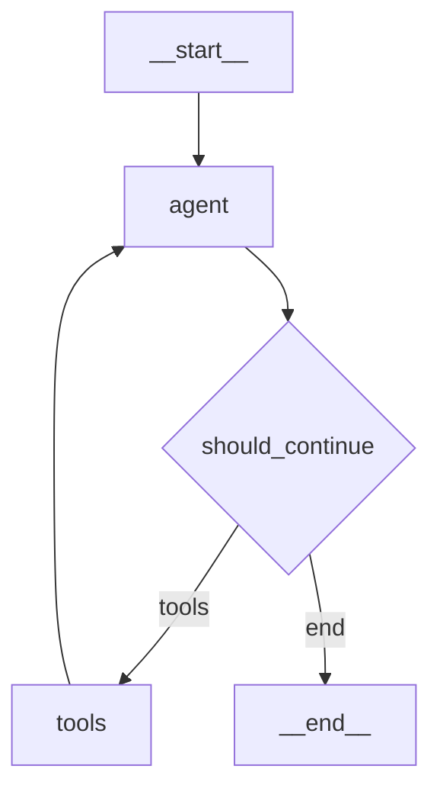

# Topic 3: Agent Tool Use

This portfolio contains implementations demonstrating how LLM agents use tools, from basic Ollama server usage to complex LangGraph tool orchestration.

## Table of Contents

| File | Description |
|------|-------------|
| `task1_mmlu_astronomy.py` | MMLU evaluation on astronomy using Ollama |
| `task1_mmlu_business_ethics.py` | MMLU evaluation on business ethics using Ollama |
| `task2_openai_test.py` | OpenAI GPT-4o Mini API verification test |
| `task3_manual_tool_handling.py` | Manual tool handling with geometric calculator |
| `task4_langgraph_tools.py` | LangGraph with calculator, letter counter, and word analyzer |
| `task5_langgraph_conversation.py` | LangGraph conversation agent with checkpointing |
| `output_task*.txt` | Output logs from running each task |
| `README.md` | This documentation file |

---

## Task 1: Ollama Server Setup and Performance Comparison

### Setup Instructions

1. Install Ollama: https://ollama.ai
2. Pull the model: `ollama pull llama3.2:1b`
3. Start the server: `ollama serve`

### Running the Programs

**Sequential execution:**
```bash
time { python task1_mmlu_astronomy.py ; python task1_mmlu_business_ethics.py ; }
```

**Parallel execution:**
```bash
time { python task1_mmlu_astronomy.py & python task1_mmlu_business_ethics.py & wait; }
```

### Observations

When running with Ollama:

- **Sequential execution**: Each program runs one after another, with the total time being the sum of both execution times. The Ollama server handles one request at a time.

- **Parallel execution**: Both programs send requests to the Ollama server simultaneously. However, the Ollama server typically processes requests sequentially on a single GPU, so parallelization benefits depend on:
  - Whether the GPU can batch multiple requests
  - The overhead of context switching between requests
  - Available VRAM for loading model weights

**Expected Results:**
- On a system with limited GPU resources, parallel execution may not significantly improve wall-clock time because the server serializes GPU operations
- On systems with batch processing support or multiple GPUs, parallel execution can reduce total time
- The main benefit of the server model is decoupling the model loading (done once) from inference (done per request)

---

## Task 2: OpenAI API Setup

### Environment Setup

**For laptop/local development:**
```bash
export OPENAI_API_KEY="your-actual-key"
```

**For Google Colab:**
```python
from google.colab import userdata
import os
os.environ["OPENAI_API_KEY"] = userdata.get('OPENAI_API_KEY')
```

### Code Explanation

```python
client = OpenAI()
```
This creates an OpenAI client instance that:
- Automatically reads `OPENAI_API_KEY` from environment variables
- Establishes a connection configuration to OpenAI's API servers
- Can be reused for multiple API requests throughout the program
- Handles authentication, retries, and connection management

```python
response = client.chat.completions.create(
    model="gpt-4o-mini",
    messages=[{"role": "user", "content": "Say: Working!"}],
    max_tokens=5
)
```
This sends a chat completion request:
- `model`: Specifies GPT-4o-mini (fast, cost-effective model good for tool use)
- `messages`: A list of conversation messages with roles:
  - `"system"`: Instructions for how the model should behave
  - `"user"`: The human's input
  - `"assistant"`: Previous model responses (for multi-turn)
- `max_tokens`: Limits response length (5 tokens is very short, ~1-2 words)
- Returns a response object containing the model's reply, usage statistics, and metadata

---

## Task 3: Manual Tool Handling with Calculator

### Calculator Tool Features

The calculator supports:

**Arithmetic:**
- add, subtract, multiply, divide, power, sqrt

**Trigonometric (radians):**
- sin, cos, tan, asin, acos, atan

**Logarithmic:**
- log (base 10), ln (natural), exp

**Geometric:**
- area_circle, area_rectangle, area_triangle
- circumference
- volume_sphere, volume_cylinder, volume_cone
- hypotenuse

**Conversions:**
- degrees_to_radians, radians_to_degrees

### Forcing LLM to Use Tools

If the model tries to calculate manually instead of using tools, these strategies help:

1. **System prompt emphasis**: Include explicit instructions like "ALWAYS use the calculator tool for ALL calculations"

2. **Tool choice parameter**: Set `tool_choice="required"` or `tool_choice={"type": "function", "function": {"name": "calculator"}}` to force tool use

3. **Remove capability claims**: Tell the model it "cannot do math" in the system prompt

4. **Example demonstrations**: Provide few-shot examples showing proper tool use

---

## Task 4: LangGraph Tool Handling

### Tools Implemented

1. **calculator**: Full arithmetic and geometric calculator (from Task 3)
2. **count_letter**: Counts occurrences of a letter in text (case-insensitive)
3. **word_analyzer**: Analyzes text for statistics (word count, character count, most common letter)

### Tool Map Pattern

Instead of if/else dispatch:
```python
# Old pattern
if function_name == "get_weather":
    result = get_weather.invoke(function_args)
else:
    result = f"Error: Unknown function {function_name}"
```

Use a tool map:
```python
# Better pattern
tools = [calculator, count_letter, word_analyzer]
tool_map = {tool.name: tool for tool in tools}

if function_name in tool_map:
    result = tool_map[function_name].invoke(function_args)
else:
    result = f"Error: Unknown function {function_name}"
```

Benefits:
- Easier to add new tools (just add to the list)
- No need to modify dispatch logic
- Cleaner, more maintainable code

### Multiple Tool Use Examples

**Parallel tool calls (same turn):**
Query: "Are there more i's than s's in Mississippi riverboats?"
- The model calls `count_letter` twice in the same turn (once for 'i', once for 's')
- Both results return, then it compares them

**Sequential chaining (multiple turns):**
Query: "What is the sin of the difference between the number of i's and s's in Mississippi riverboats?"
1. Turn 1: `count_letter("Mississippi riverboats", "i")` → 5
2. Turn 1: `count_letter("Mississippi riverboats", "s")` → 5
3. Turn 2: `calculator("subtract", 5, 5)` → 0
4. Turn 3: `calculator("sin", 0)` → 0

**Using all tools:**
Query: "Analyze 'mathematical' - word count, count of a's, and square root of letter count"
1. `word_analyzer("mathematical")` → stats
2. `count_letter("mathematical", "a")` → 3
3. `calculator("sqrt", 12)` → 3.46

---

## Task 5: LangGraph Conversation Agent

### Graph Structure



### Nodes

- **agent**: Calls the LLM with current conversation history
- **tools**: Executes any tool calls from the LLM response

### Edges

- **agent → should_continue**: Conditional routing based on whether tools were called
- **tools → agent**: Loop back to process tool results
- **should_continue → end**: Exit when no more tool calls or turn limit reached

### Checkpointing and Recovery

The agent uses SQLite-based checkpointing:

```python
with SqliteSaver.from_conn_string("conversation_checkpoint.db") as checkpointer:
    app = workflow.compile(checkpointer=checkpointer)
```

**Features:**
- Conversation state persisted after each turn
- Resume conversations using thread_id
- Survives program restarts
- Full conversation history maintained

**Recovery demonstration:**
1. Start conversation with thread "demo123"
2. Ask questions, get responses
3. Quit the program
4. Restart and enter "demo123"
5. Previous conversation is restored and context is maintained

---

## Task 6: Parallelization Opportunity

### Question
Where is there an opportunity for parallelization in the agent that is not yet being taken advantage of?

### Answer

The main parallelization opportunity is in **tool execution when multiple tools are called in the same turn**.

When the LLM returns multiple tool calls in a single response (e.g., counting both 'i' and 's' in "Mississippi"), the current implementation executes them **sequentially**:

```python
for tool_call in last_message.tool_calls:
    # Each tool is called one after another
    result = tool_map[tool_name].invoke(tool_args)
```

**Optimization opportunity:**
These independent tool calls could be executed **in parallel** using:

1. **asyncio.gather()** for async tools:
```python
async def call_tools_parallel(tool_calls):
    tasks = [tool_map[tc["name"]].ainvoke(tc["args"]) for tc in tool_calls]
    return await asyncio.gather(*tasks)
```

2. **ThreadPoolExecutor** for synchronous tools:
```python
from concurrent.futures import ThreadPoolExecutor

with ThreadPoolExecutor() as executor:
    futures = [executor.submit(tool_map[tc["name"]].invoke, tc["args"])
               for tc in tool_calls]
    results = [f.result() for f in futures]
```

**Benefits:**
- Reduced latency when tools have I/O wait (API calls, database queries)
- Better resource utilization
- Significant speedup for independent tool operations

**When it matters:**
- Tools that call external APIs (weather, search)
- Tools that query databases
- Tools with computational overhead
- Less benefit for simple CPU-bound calculations

---

## Requirements

```bash
pip install openai langchain langchain-openai langgraph datasets tqdm requests
```

## Running the Tasks

```bash
# Task 1 - Ollama (requires ollama serve running)
python task1_mmlu_astronomy.py
python task1_mmlu_business_ethics.py

# Task 2 - OpenAI test
python task2_openai_test.py

# Task 3 - Manual tool handling
python task3_manual_tool_handling.py

# Task 4 - LangGraph tools
python task4_langgraph_tools.py

# Task 5 - Conversation with checkpointing
python task5_langgraph_conversation.py        # Interactive mode
python task5_langgraph_conversation.py --demo # Demo mode
```
