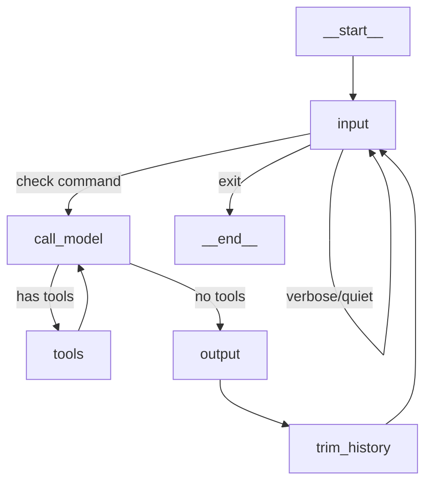
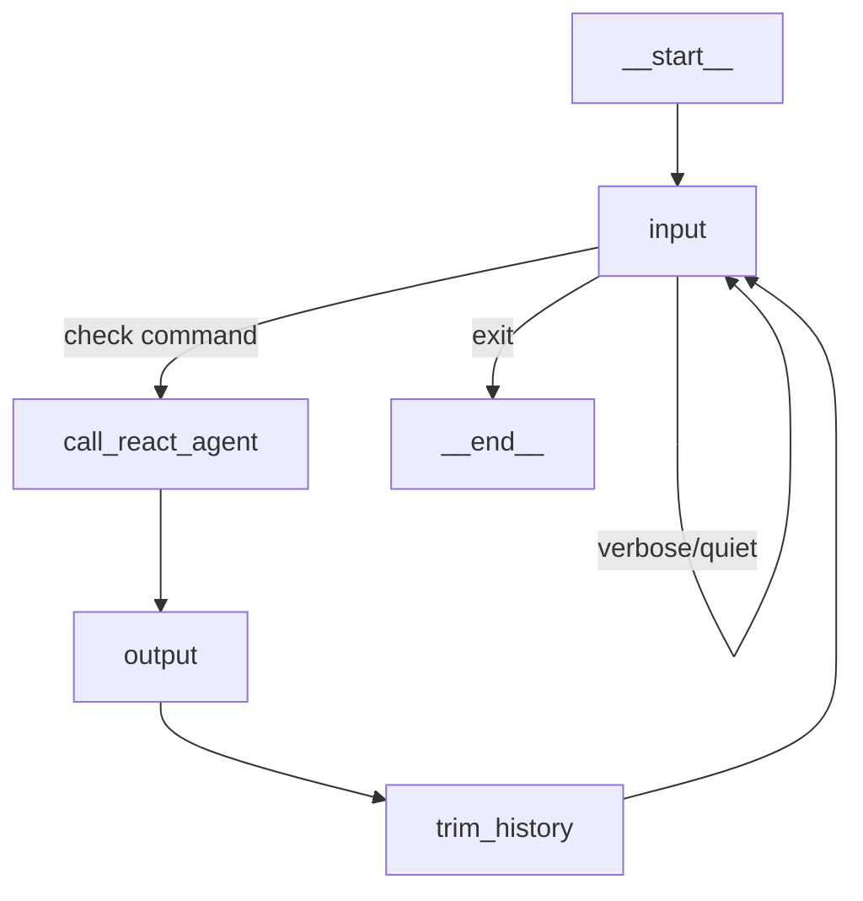

# Topic 4: Exploring Tools - Portfolio Answers

## Code Analysis: `toolnode_example.py` vs `react_agent_example.py`

---

## Question 1: What features of Python does ToolNode use to dispatch tools in parallel? What kinds of tools would most benefit from parallel dispatch?

### Python Features for Parallel Dispatch

**ToolNode leverages Python's `asyncio` module for parallel tool execution.** The key evidence is in how the tools are defined in each file:

**In `toolnode_example.py` (ToolNode approach):**
```python
@tool
async def get_weather(location: str) -> str:
    """Get current weather information..."""
    await asyncio.sleep(0.5)  # Simulates I/O-bound operation
    return f"Weather in {location}: Sunny, 72°F with light winds"

@tool
async def get_population(city: str) -> str:
    """Get population information..."""
    await asyncio.sleep(0.5)  # Simulates I/O-bound operation
    return f"Population of {city}: Approximately 1 million people"
```

**In `react_agent_example.py` (ReAct agent approach):**
```python
@tool
def get_weather(location: str) -> str:
    """Get current weather information..."""
    time.sleep(0.5)  # Blocking synchronous call
    return f"Weather in {location}: Sunny, 72°F with light winds"

@tool
def get_population(city: str) -> str:
    """Get population information..."""
    time.sleep(0.5)  # Blocking synchronous call
    return f"Population of {city}: Approximately 1 million people"
```

### The Python Features at Play:

1. **`async/await` syntax** - Tools are declared as coroutines with `async def`, enabling non-blocking execution
2. **`asyncio.gather()` or similar** - Under the hood, ToolNode can dispatch multiple async tools concurrently using asyncio's event loop
3. **Coroutines as first-class objects** - Python treats async functions as objects that can be scheduled, awaited, and run in parallel
4. **Event loop architecture** - asyncio's event loop can manage multiple I/O operations simultaneously without threading overhead

### Tools That Benefit Most from Parallel Dispatch:

| Tool Type | Why Parallel Dispatch Helps | Example |
|-----------|----------------------------|---------|
| **API calls** | Network latency dominates - multiple calls can overlap | Weather API, Stock prices, Database queries |
| **File I/O** | Disk operations have wait time that can be overlapped | Reading multiple config files, log analysis |
| **Database queries** | Query execution time overlaps with other queries | Multi-table lookups, aggregation queries |
| **External service calls** | Service response times are independent | Email services, notification systems |
| **Web scraping** | HTTP requests have high latency | Gathering data from multiple URLs |

**Tools that DON'T benefit:**
- CPU-bound calculations (need multiprocessing, not asyncio)
- Operations with dependencies (must wait for previous result)
- Single quick operations (overhead > benefit)

---

## Question 2: How do the two programs handle special inputs such as "verbose" and "exit"?

### Both Programs Handle Special Inputs Identically!

Both programs use the **same `input_node` function** with the **same `route_after_input` router**. Here's the pattern:

```python
def input_node(state: ConversationState) -> ConversationState:
    user_input = input("\nYou: ").strip()
    
    # Handle exit commands
    if user_input.lower() in ["quit", "exit"]:
        return {"command": "exit"}  # Sets command field only
    
    # Handle verbose toggle
    if user_input.lower() == "verbose":
        print("[SYSTEM] Verbose mode enabled")
        return {"command": "verbose", "verbose": True}
    
    if user_input.lower() == "quiet":
        print("[SYSTEM] Verbose mode disabled")
        return {"command": "quiet", "verbose": False}
    
    # Normal message - add to conversation
    return {"command": None, "messages": [HumanMessage(content=user_input)]}
```

### Key Design Decisions:

1. **Command Field Pattern** - Special inputs set a `command` field in state instead of adding messages
   - This avoids polluting the conversation history with "exit" or "verbose" as user messages
   - Clean separation between control flow and conversation content

2. **Routing Logic:**
```python
def route_after_input(state) -> Literal["call_model", "end", "input"]:
    command = state.get("command")
    
    if command == "exit":
        return "end"  # Routes to END node - terminates graph
    
    if command in ["verbose", "quiet"]:
        return "input"  # Routes BACK to input - immediate re-prompt
    
    return "call_model"  # Normal flow continues
```

3. **State-Based Verbose Control:**
   - `verbose: bool` in state controls debug output throughout all nodes
   - Each node checks `state.get("verbose", True)` before printing debug info
   - Default is `True` (verbose on)

### Supported Commands:

| Command | Effect | Route |
|---------|--------|-------|
| `exit` / `quit` | End conversation | → END |
| `verbose` | Enable debug tracing | → input (loop back) |
| `quiet` | Disable debug tracing | → input (loop back) |
| anything else | Process as user message | → agent |

---

## Question 3: Compare the graph diagrams of the two programs. How do they differ?

### ToolNode Example Graph Structure:



**Key characteristics:**
- Explicit `tools` node (ToolNode) in the graph
- **TWO conditional routers**: one after input, one after call_model
- `tools → call_model` loop for multi-step reasoning
- 5 custom nodes: input, call_model, tools, output, trim_history

---

### ReAct Agent Example Graph Structure:



**Key characteristics:**
- `call_react_agent` is a **black box** - the internal tool loop is hidden
- **ONE conditional router**: only after input
- Tool execution happens INSIDE the react agent (invisible in main graph)
- 4 custom nodes: input, call_react_agent, output, trim_history

---

### Side-by-Side Comparison:

| Aspect | ToolNode Example | ReAct Agent Example |
|--------|------------------|---------------------|
| **Node count** | 5 nodes | 4 nodes |
| **Tool visibility** | Explicit `tools` node | Hidden inside agent |
| **Tool loop** | Visible: `call_model ↔ tools` | Invisible (internal) |
| **Conditional edges** | 2 (after input, after model) | 1 (after input only) |
| **Customization** | Full control over tool flow | Limited to agent config |
| **Complexity** | More complex graph | Simpler wrapper graph |
| **Generated images** | `langchain_manual_tool_graph.png` | `langchain_react_agent.png` + `langchain_conversation_graph.png` |

### The ReAct Agent Generates TWO Graphs!

The `react_agent_example.py` creates visualizations for:
1. **Internal ReAct agent** (`langchain_react_agent.png`) - shows thought/action/observation loop
2. **Conversation wrapper** (`langchain_conversation_graph.png`) - shows the outer conversation loop

---

## Question 4: What is an example of a case where the structure imposed by the LangChain react agent is too restrictive and you'd want to pursue the toolnode approach?

### Cases Where ToolNode is Better:

#### 1. **Custom Tool Orchestration Logic**

**Scenario:** You need tools to execute in a specific order, or you need to validate/transform tool outputs before the LLM sees them.

```python
# With ToolNode, you can add custom logic:
def custom_tool_handler(state):
    # Run security scan BEFORE any other tool
    if has_sensitive_tools(state):
        security_result = run_security_check(state)
        if not security_result.approved:
            return {"messages": [AIMessage(content="Security check failed")]}
    
    # Now run the actual tools
    tool_results = tool_node.invoke(state)
    
    # Post-process results (sanitize, validate, transform)
    sanitized = sanitize_tool_outputs(tool_results)
    return sanitized
```

**ReAct agent limitation:** You can't inject custom logic between tool calls - it's a closed loop.

#### 2. **Parallel Tool Execution with Custom Batching**

**Scenario:** You need to batch API calls to stay under rate limits, or combine results in specific ways.

```python
# With ToolNode, you control the execution:
async def batched_tool_execution(state):
    pending_tools = get_pending_tool_calls(state)
    
    # Batch by rate-limited service
    weather_calls = [t for t in pending_tools if t.name == "get_weather"]
    other_calls = [t for t in pending_tools if t.name != "get_weather"]
    
    # Rate-limit weather calls (max 5 concurrent)
    weather_results = await process_with_rate_limit(weather_calls, max_concurrent=5)
    other_results = await asyncio.gather(*other_calls)
    
    return combine_results(weather_results, other_results)
```

#### 3. **Human-in-the-Loop Tool Approval**

**Scenario:** Certain tools require human approval before execution (financial transactions, emails, etc.).

```python
def tool_approval_node(state):
    tool_calls = get_pending_tool_calls(state)
    
    sensitive_tools = [t for t in tool_calls if t.name in REQUIRES_APPROVAL]
    
    if sensitive_tools:
        # Pause and wait for human approval
        approved = await request_human_approval(sensitive_tools)
        if not approved:
            return {"messages": [AIMessage(content="Tool execution cancelled by user")]}
    
    # Proceed with approved tools only
    return tool_node.invoke(state)
```

**ReAct agent limitation:** No hook point for human approval between reasoning and tool execution.

#### 4. **Tool Fallback/Retry Logic**

**Scenario:** You need to retry failed tools with different parameters, or fall back to alternative tools.

```python
async def resilient_tool_execution(state):
    tool_calls = get_pending_tool_calls(state)
    results = []
    
    for tool in tool_calls:
        try:
            result = await execute_with_retry(tool, max_retries=3)
            results.append(result)
        except ToolFailure:
            # Try fallback tool
            fallback = get_fallback_tool(tool.name)
            if fallback:
                result = await fallback.invoke(tool.args)
                results.append(result)
            else:
                results.append(ToolMessage(content=f"Tool {tool.name} failed"))
    
    return {"messages": results}
```

#### 5. **Multi-Agent Tool Sharing**

**Scenario:** Multiple specialized agents need to share tools, and you need to route tool calls to the appropriate agent.

```python
def multi_agent_tool_router(state):
    tool_calls = get_pending_tool_calls(state)
    
    # Route to specialized agents based on tool type
    research_tools = route_to_agent(tool_calls, "research_agent", ["web_search", "arxiv"])
    code_tools = route_to_agent(tool_calls, "code_agent", ["execute_python", "git"])
    data_tools = route_to_agent(tool_calls, "data_agent", ["sql_query", "pandas"])
    
    # Execute in parallel across agents
    results = await asyncio.gather(
        research_agent.invoke(research_tools),
        code_agent.invoke(code_tools),
        data_agent.invoke(data_tools)
    )
    
    return merge_agent_results(results)
```

### Summary: When to Use Each

| Use Case | ReAct Agent ✅ | ToolNode ✅ |
|----------|----------------|-------------|
| Simple chatbot with tools | ✅ Perfect | Overkill |
| Rapid prototyping | ✅ Fast setup | More work |
| Custom tool orchestration | ❌ Too rigid | ✅ Full control |
| Human-in-the-loop approval | ❌ No hook | ✅ Add approval node |
| Rate limiting / batching | ❌ No control | ✅ Custom logic |
| Tool output transformation | ❌ Closed loop | ✅ Post-process node |
| Multi-agent coordination | ❌ Single agent | ✅ Route to agents |
| Debugging tool issues | ❌ Black box | ✅ Visible in graph |

---

## Bonus: The Zen of These Two Approaches

> "Simple is better than complex." - Use ReAct agent when you can.
>
> "Complex is better than complicated." - Use ToolNode when you need control.
>
> "Explicit is better than implicit." - ToolNode shows you exactly what's happening.
>
> "Readability counts." - ReAct agent is easier to understand at first glance.

The ToolNode approach follows the **Zen of Python** principle: *"In the face of ambiguity, refuse the temptation to guess."* When you need precise control over tool execution, don't guess what ReAct is doing internally - be explicit with ToolNode! 🐍

---

## Appendix: Actual Test Results (Persistence Verified! ✅)

### ReAct Agent Test Output:
```
You: What is the weather in NYC?
[DEBUG] Invoking ReAct agent with 1 messages in history
[DEBUG] Agent generated 3 new messages
[DEBUG] Tool calls: ['get_weather']
Assistant: The weather in NYC is currently sunny with a temperature of 72°F and light winds.

You: What about the population there?
[DEBUG] Invoking ReAct agent with 5 messages in history  ← PERSISTENCE!
[DEBUG] Agent generated 3 new messages
[DEBUG] Tool calls: ['get_population']
Assistant: The population of NYC is approximately 1 million people.
```

**Key observation:** The second turn had **5 messages** in history (user1 + ai1 + tool_call + tool_result + user2), proving the conversation context was preserved!

### ToolNode Test Output:
```
You: What is the weather in NYC?
[DEBUG] Calling model with 1 messages
[DEBUG] Model requested 1 tool call(s): get_weather({'location': 'NYC'})
[DEBUG] Routing to tools
[DEBUG] Calling model with 4 messages  ← After tool execution
Assistant: The current weather in NYC is sunny, with a temperature of 72°F and light winds.

You: What about the population there?
[DEBUG] Calling model with 7 messages  ← PERSISTENCE!
[DEBUG] Model requested 1 tool call(s): get_population({'city': 'New York City'})
[DEBUG] Routing to tools
[DEBUG] Calling model with 10 messages  ← After tool execution
Assistant: The population of New York City is approximately 1 million people.
```

**Key observation:** You can clearly see the `call_model → tools → call_model` loop in action, and the message count grows across turns!

### Generated Graph Files:
| File | Size | Dimensions |
|------|------|------------|
| `langchain_react_agent.png` | 9.3 KB | 216 x 249 |
| `langchain_conversation_graph.png` | 20.7 KB | 412 x 471 |
| `langchain_manual_tool_graph.png` | 22.4 KB | 371 x 471 |

---

*Portfolio document created for CS6501 Topic 4: Exploring Tools*
